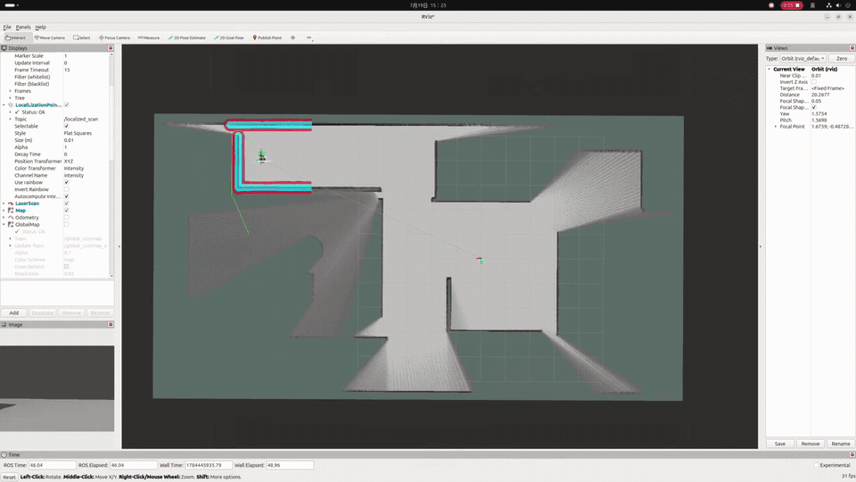

# RF Robot V2

这是一个基于 ROS 2 的移动机器人导航与建图工作区，当前代码已经具备一套可运行的基础框架：仿真模型、静态/局部代价地图、全局路径规划、局部轨迹跟踪、地图管理、纯定位，以及基于 Cartographer 的 2D 建图与前沿探索接入。

仓库里的核心思路不是把所有功能拆成单独进程，而是通过 `rf_main` 把多个自研 node 组合到一个主进程里运行，再配合 `robot_model` 提供 Gazebo 仿真入口。

## 演示视频



## 当前项目已经实现了什么

- `rf_main`
  统一启动并托管以下节点：
  `rf_global_map`、`rf_local_map`、`rf_localization`、`rf_map_manager`、`rf_global_planner`、`rf_scheduler_node`、`rf_map_builder`。
  现在额外包含 `rf_local_planner`，用于局部路径跟踪与速度控制。

- `rf_costmap`
  提供代价地图基础库，已经实现：
  `StaticLayer`、`ObstacleLayer`、`InflationLayer`、`MasterCostmap`、`CostmapPublisher`。
  其中 `StaticLayer` 既兼容磁盘加载的三值静态地图，也兼容运行中的 `/slam_map -> /map` 占据概率地图；
  `ObstacleLayer` 默认消费 `/scan`，通过 TF 过滤后在代价地图里执行清障射线和障碍写入。

- `rf_global_map`
  维护全局代价地图，默认加载图层：
  `static_layer + obstacle_layer + inflation_layer`。
  通过服务控制启动/停止更新，并在启动时请求静态地图发布。

- `rf_local_map`
  维护局部滚动窗口代价地图，默认大小 `5m x 5m`、分辨率 `0.025m`，图层为：
  `obstacle_layer + inflation_layer`。

- `rf_map_manager`
  负责静态占据栅格地图的加载、缓存、发布、查询与导出。
  当前支持：
  从 `~/.rf_robot/map/occ_map.yaml` 和 `occ_map.pgm` 读取地图；
  订阅 `/slam_map` 并缓存最新建图结果；
  将缓存地图转发到 `/map`；
  发布 `/map`；
  提供 `/get_map`、`/dump_map`、`/publish_static_map`、`/save_map` 服务。

- `rf_global_planner`
  已实现一个默认全局规划器 `DefaultPlanner`，在自定义 `rf_robot_msgs/msg/Costmap` 上进行基于网格的搜索。
  目前能力包括：
  `ComputePathToPose` action；
  `ComputePathThroughPoses` action；
  路径发布到 `/global_path`；
  支持从 TF 获取当前位置作为起点；
  支持目标点容差搜索。

- `rf_local_planner`
  提供一个尽量简单的 DWA 局部控制器，当前已经实现：
  订阅 `/local_costmap_raw`、`odom`；
  使用动态窗口采样线速度和角速度；
  对候选轨迹执行前向仿真、碰撞检查和路径/目标/障碍打分；
  通过 `/follow_path` action 接收全局轨迹并持续跟踪；
  发布 `/cmd_vel`；
  发布调试轨迹 `/local_trajectory`；
  可选发布调试可视化 `/local_trajectories_debug`。

- `rf_scheduler_node`
  既支持手动导航，也支持简单的自主探索。
  当前支持：
  订阅 `/goal_pose`，串联 `/compute_path_to_pose` 和 `/follow_path` 完成导航；
  提供 `/explore_map` action，执行基于 frontier 的探索；
  在探索开始前停止纯定位、启动建图与代价地图；
  在探索结束后停止建图、等待最终 `/slam_map`、并调用 `/save_map` 落盘。

- `rf_map_builder`
  对 Cartographer 2D 建图进行了 ROS 2 侧封装，当前已实现：
  从 Lua 配置加载建图参数；
  默认从 `src/rf_map_builder/config` 提供 Cartographer Lua 配置依赖；
  通过 `/build_map` 服务启动/停止 trajectory；
  订阅 `scan`、`points2`、`odom`、`imu`、`landmark`；
  发布 `/slam_map`；
  发布 `submap_list`、`tracked_pose`、`scan_matched_points2`；
  发布 `map -> odom` TF；
  支持激光、点云、里程计、IMU、地标数据桥接到 Cartographer。

- `rf_localization`
  提供纯定位节点，当前已经实现：
  定位方法可选框架；
  基于静态 `/map` + `scan` + `odom` 的 2D ICP 定位；
  发布定位位姿；
  发布配准后的 `localized_scan`；
  发布 `map -> odom` TF；
  通过 `/localization_control` 服务启停定位。

- `robot_model`
  提供 Gazebo 仿真资源，包含：
  `fishbot_gazebo.urdf`；
  `fish.world`；
  `gazebo.launch.py`。
  该 launch 会启动 Gazebo、`robot_state_publisher`、`ros_gz_bridge`、`rf_main` 和 `rviz2`。

- `rf_robot_msgs`
  已定义项目内部使用的消息、服务和 action，包括：
  `Costmap`、`SubmapList`、`LandmarkList`、
  `GetMap`、`DumpMap`、`ReqAck`、
  `ComputePathToPose`、`ComputePathThroughPoses`、`FollowPath`、`ExploreMap`。

## 仓库结构

- `src/rf_main`
  主程序入口，组合多个节点并分三个 executor 线程运行。

- `src/rf_costmap`
  代价地图核心实现。

- `src/rf_global_map`
  全局代价地图节点。

- `src/rf_local_map`
  局部代价地图节点。

- `src/rf_localization`
  纯定位节点与定位方法实现，当前内置 ICP。

- `src/rf_map_manager`
  静态地图读写与发布。

- `src/rf_global_planner`
  全局规划 action 服务与默认规划器。

- `src/rf_scheduler_node`
  轻量调度层，负责手动导航串联与 frontier 探索。

- `src/rf_local_planner`
  简化版 DWA 局部控制器。

- `src/rf_map_builder`
  Cartographer 2D 建图接入层。

- `idl/rf_robot_msgs`
  自定义消息、服务、action。

- `src/robot_model`
  Gazebo 仿真模型与启动文件。

- `src/cartographer`
  引入的 Cartographer 源码。

- `src/elog`
  日志库。

## 节点关系

系统目前的大致数据流如下：

1. `rf_map_builder` 接入 `scan/odom/imu/...`，维护 Cartographer trajectory，并持续发布 `/slam_map`。
2. `rf_map_manager` 缓存 `/slam_map`，必要时从磁盘重载，并统一发布 `/map` 给下游模块。
3. `rf_global_map` 订阅 `/map`，生成 `/global_costmap` 和 `/global_costmap_raw`。
4. `rf_local_map` 基于 `/scan` 和 TF 生成 `/local_costmap` 与 `/local_costmap_raw`。
5. `rf_global_planner` 订阅 `/global_costmap_raw`，对外提供路径规划 action。
6. `rf_scheduler_node` 监听 `/goal_pose` 时，会先调用全局规划 action，再把返回路径转发给局部规划 action。
7. `rf_local_planner` 接收 `/follow_path` action 与 `/local_costmap_raw`，输出 `/cmd_vel`。
8. `rf_localization` 订阅静态地图、激光和里程计，执行纯定位并维护 `map -> odom` TF。
9. `rf_scheduler_node` 接收 `/explore_map` 时，会编排 `/build_map`、地图更新控制和 `/save_map`，形成“探索完成后自动保存地图”的闭环。

## 关键接口

### Topics

- 输入
  `scan`
  `points2`
  `odom`
  `imu`
  `landmark`
  `/goal_pose`

- 输出
  `/slam_map`
  `/map`
  `/global_costmap`
  `/global_costmap_raw`
  `/local_costmap`
  `/local_costmap_raw`
  `/global_path`
  `/local_trajectory`
  `/local_trajectories_debug`
  `/cmd_vel`
  `localization_pose`
  `localized_scan`
  `submap_list`
  `tracked_pose`
  `scan_matched_points2`

### Services

- `/global_map_control`
  启停全局代价地图更新。

- `/local_map_control`
  启停局部代价地图更新。

- `/publish_static_map`
  触发静态地图发布。

- `/save_map`
  将当前缓存的 `/slam_map` 以 `occ_map.{yaml,pgm}` 形式保存到磁盘。

- `/get_map`
  获取当前缓存的静态地图。

- `/dump_map`
  将 `nav_msgs/OccupancyGrid` 导出到磁盘。

- `/build_map`
  启动或停止 Cartographer trajectory。

- `/localization_control`
  启停纯定位节点。

### Actions

- `/compute_path_to_pose`
  计算起点到目标点的全局路径。

- `/compute_path_through_poses`
  计算经过多个途经点的全局路径。

- `/follow_path`
  执行局部轨迹跟踪并输出速度控制。

- `/explore_map`
  启动一次 frontier 探索任务；任务完成后会尝试停止建图并保存地图。

## 默认配置与行为

### 地图管理

- 静态地图目录固定为：
  `~/.rf_robot/map`

- 默认读取文件：
  `~/.rf_robot/map/occ_map.yaml`
  `~/.rf_robot/map/occ_map.pgm`

- `rf_map_manager` 会持续缓存 `/slam_map`，并把最新缓存转发到 `/map`。

- `/save_map` 会把缓存地图按三值模式写回：
  `occupied_thresh = 0.65`
  `free_thresh = 0.196`

- `rf_costmap::StaticLayer` 读取 `/map` 时，会把 `>= 65` 视作障碍、`<= 19` 视作空闲，其余视作未知，
  这样既兼容落盘的三值地图，也兼容运行中的概率栅格。

### Cartographer 配置

- 默认配置文件：
  `src/rf_map_builder/config/default_map_builder_cfg.lua`

- 配置依赖文件位于：
  `src/rf_map_builder/config/map_builder.lua`
  `src/rf_map_builder/config/pose_graph.lua`
  `src/rf_map_builder/config/trajectory_builder.lua`
  `src/rf_map_builder/config/trajectory_builder_2d.lua`
  `src/rf_map_builder/config/trajectory_builder_3d.lua`

- 运行时搜索路径顺序：
  `rf_map_builder` 包内 `share/.../config`
  `~/.rf_robot/config`

- 推荐修改方式：
  优先修改 `src/rf_map_builder/config/` 下的 Lua；
  或复制一份到 `~/.rf_robot/config` 做运行时覆盖；
  不再推荐直接修改 `src/cartographer/configuration_files/`。

- 默认配置启用了：
  2D trajectory builder
  `tracking_frame = base_link`
  `odom_frame = odom`
  `use_odometry = true`
  `use_imu_data = true`
  `num_laser_scans = 1`

### 纯定位配置

- `rf_localization` 默认订阅：
  `/map`
  `scan`
  `odom`

- `rf_localization` 默认发布：
  `localization_pose`
  `localized_scan`
  `map -> odom`

- 关键节点参数：
  `localization_method = icp`
  `map_frame = map`
  `odom_frame = odom`
  `base_frame = base_link`
  `tf_publish_period_sec = 0.05`
  `tf_lookup_timeout_sec = 0.1`
  `initial_pose.x = 0.0`
  `initial_pose.y = 0.0`
  `initial_pose.yaw = 0.0`
  `publish_aligned_scan = true`
  `autostart = true`

- 当前 ICP 参数默认值：
  `icp.map_occupied_threshold = 65`
  `icp.min_scan_points = 20`
  `icp.map_voxel_leaf_size = 0.05`
  `icp.scan_voxel_leaf_size = 0.05`
  `icp.max_correspondence_distance = 0.5`
  `icp.transformation_epsilon = 1e-4`
  `icp.fitness_epsilon = 1e-3`
  `icp.fitness_score_threshold = 0.3`
  `icp.max_iterations = 50`

## 快速开始

### 1. 编译

```bash
colcon build --symlink-install
source install/setup.bash
```

### 2. 准备运行目录

```bash
mkdir -p ~/.rf_robot/map
mkdir -p ~/.rf_robot/config
```

如果需要全局静态地图，请提前准备：

```text
~/.rf_robot/map/occ_map.yaml
~/.rf_robot/map/occ_map.pgm
```

### 3. 启动仿真

```bash
ros2 launch robot_model gazebo.launch.py
```

这个 launch 默认会一起拉起：

- Gazebo
- `robot_state_publisher`
- `ros_gz_bridge`
- `rf_main`
- `rviz2`

### 4. 启动建图

```bash
ros2 service call /build_map rf_robot_msgs/srv/ReqAck "{trigger: 0}"
```

`ReqAck.trigger` 里 `0=START`，`1=STOP`。下面几个控制 service 也都沿用这个约定。

### 5. 启动地图更新

```bash
ros2 service call /global_map_control rf_robot_msgs/srv/ReqAck "{trigger: 0}"
ros2 service call /local_map_control rf_robot_msgs/srv/ReqAck "{trigger: 0}"
```

### 6. 启停纯定位

```bash
ros2 service call /localization_control rf_robot_msgs/srv/ReqAck "{trigger: 0}"  # START
ros2 service call /localization_control rf_robot_msgs/srv/ReqAck "{trigger: 1}"  # STOP
```

如果需要给 `rf_localization` 指定初始位姿，可以在启动时覆盖参数，例如：

```bash
ros2 run rf_main rf_main --ros-args \
  -p localization_node:initial_pose.x:=1.0 \
  -p localization_node:initial_pose.y:=2.0 \
  -p localization_node:initial_pose.yaw:=0.5
```

### 7. 发送目标点

可以向 `/goal_pose` 发布 `geometry_msgs/msg/PoseStamped`，调度节点会自动转发给全局规划器。

### 8. 启动一次自主探索并自动保存地图

```bash
ros2 action send_goal /explore_map rf_robot_msgs/action/ExploreMap "{}"
```

这条 action 会由 `rf_scheduler_node` 自动串起下面几步：

- 停止 `/localization_control`
- 启动 `/local_map_control` 和 `/global_map_control`
- 启动 `/build_map`
- 基于 `/slam_map` 做 frontier 选点与导航
- 结束时停止 `/build_map` 并调用 `/save_map`

探索成功后，地图会保存到 `~/.rf_robot/map/occ_map.yaml` 和 `occ_map.pgm`。

### 9. 手动保存当前 SLAM 地图

```bash
ros2 service call /save_map rf_robot_msgs/srv/ReqAck "{trigger: 0}"
```

## 当前实现边界

从代码现状看，这个项目已经具备“探索建图 + 地图保存 + 全局规划 + 局部跟踪 + 仿真入口”的基础闭环，但还不是完整导航栈。当前边界大致如下：

- `rf_map_builder` 已能发布 `/slam_map` 并配合 `/save_map` 形成落盘链路，但还没有看到 `pbstream` 导出、重定位恢复或多 session 地图管理。
- 全局规划器目前只有一个默认规划器，核心是基于代价地图网格搜索的 2D 路径规划。
- `rf_local_planner` 已具备基础 DWA 跟踪能力，但还没有恢复行为、避障策略切换或更完整的控制约束模型。
- `rf_scheduler_node` 已经包含 frontier 探索流程，但整体仍是单机、单机器人、启发式规则驱动的轻量调度实现。
- 顶层统一启动主要通过 `robot_model/gazebo.launch.py` 和 `rf_main`，独立节点 launch、参数模板和部署脚本还比较少。

## 适合继续补强的方向

- 增加 `pbstream`、地图切换和多地图管理流程。
- 补强 frontier 探索的参数化能力、失败恢复和可视化诊断。
- 增强局部规划与控制器，实现更稳定的真实导航闭环。
- 为各包补充更完整的参数化配置与 launch 文件。
- 为关键模块补更多单元测试与集成测试。

## 备注

仓库内的 `src/cartographer` 与 `src/elog` 更像依赖源码或内置第三方组件，项目的主要自研逻辑集中在 `rf_*` 系列包和 `idl/rf_robot_msgs`。
